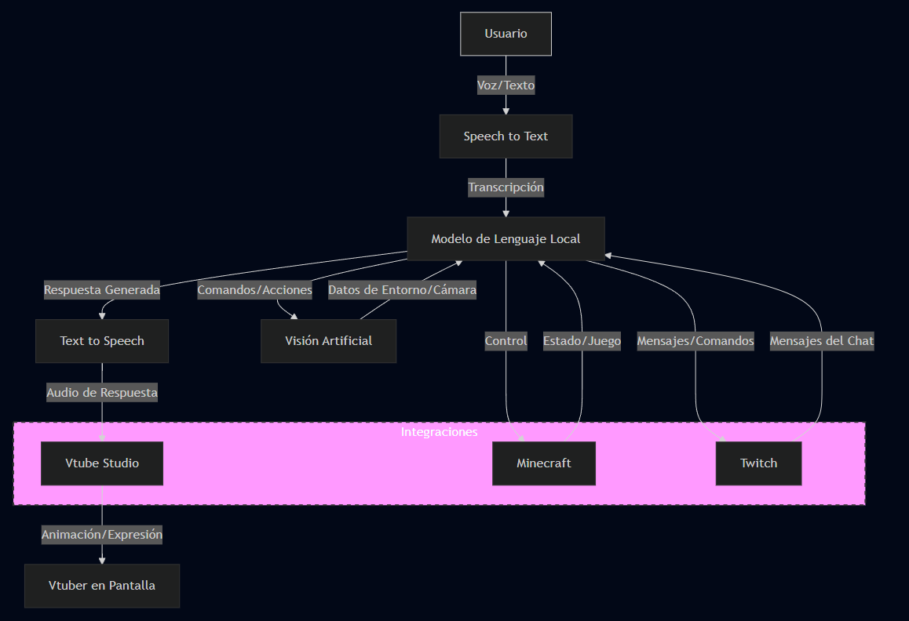

# C.H.R.I.S. - Cognitive Humanoid Real-Time Interactive Streamer

## Descripción breve
C.H.R.I.S. es un proyecto de IA VTuber en español, cuyo objetivo es crear un streamer virtual interactivo y autónomo. El sistema integra tecnologías como Text to Speech, Speech to Text, Visión Artificial, un modelo de lenguaje local, reacción en tiempo real con VTube Studio, interacción en Minecraft y conexión con Twitch, brindando una experiencia innovadora de entretenimiento.

## Estado del proyecto
🚧 **Fase de planeación**: Actualmente, el proyecto se encuentra en etapa conceptual. Se están definiendo los módulos y tecnologías a utilizar. No hay código funcional todavía.

## Imágenes, capturas o fotos

## Instalación
Aún no disponible. Próximamente se detallarán los requisitos y pasos para instalar y ejecutar el proyecto una vez haya una versión inicial.

## Tareas futuras / Roadmap
- [ ] Definición detallada de módulos principales:
  - Text to Speech (TTS)
  - Speech to Text (STT)
  - Visión Artificial
  - Modelo de lenguaje local
  - Integración con VTube Studio
  - Integración con Minecraft en tiempo real
  - Conexión con Twitch (chat y comandos)
- [ ] Selección de tecnologías y frameworks para cada módulo.
- [ ] Prototipo inicial de interacción básica.
- [ ] Documentación de arquitectura.
- [ ] Publicación de una primera versión funcional.

## Contacto o créditos
Desarrollado por: AmiyaMihari  
GitHub: [AmiyaMihari](https://github.com/AmiyaMihari)  
¿Quieres colaborar? ¡Contáctame por GitHub!

## Licencia
Open Source.